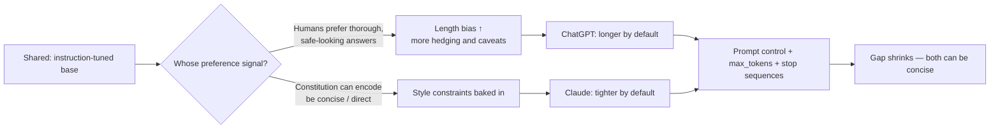

# ChatGPT vs Claude — RLHF Verbosity Lab

A small, reproducible lab + dashboard for answering a concrete question:

> **Why does Claude often feel more concise than ChatGPT, and what can you do about it?**

The short technical answer is that verbosity is mostly a product of **training and
decoding incentives**, not the model "wanting" to yap:

- **Preference tuning rewards completeness.** RLHF / RLAIF often prefers thorough,
  safe-looking answers over terse ones, so models learn to elaborate.
- **Uncertainty expands output.** When less confident, models hedge and pad to avoid
  being wrong.
- **Decoder behavior favors fluent continuation.** Once a model enters "explanatory
  mode" it tends to keep going past the minimum useful point.
- **Safety systems add padding.** Guardrails encourage caveats and broad framing.

Claude *feeling* tighter is usually a combination of model training, response-style
tuning, and product-level defaults — not one model being universally "smarter."

This repo lets you **measure** these effects instead of arguing about them.

## What's inside

| Capability | Where |
| --- | --- |
| **Verbosity metrics** (length, hedges, caveats, filler, lexical diversity) | [src/verbosity_lab/metrics.py](src/verbosity_lab/metrics.py) |
| **Verbosity-bias score** (extra words beyond the leanest answer to the same prompt) | [src/verbosity_lab/scoring.py](src/verbosity_lab/scoring.py) |
| **Prompt-engineering audit** (baseline vs "be concise", "3 bullets, no caveats", word limits, …) | [config/techniques.yaml](config/techniques.yaml) |
| **Temperature sweep** (impact of temperature on conciseness) | [scripts/run_experiment.py](scripts/run_experiment.py) |
| **RLHF transparency scorecard** (editable rubric, 0–5 per dimension) | [config/rlhf_transparency.yaml](config/rlhf_transparency.yaml) |
| **Comparison dashboard** | [dashboard/app.py](dashboard/app.py) |

The repo ships with an **offline mock provider** so the whole pipeline and dashboard
run with **no API keys**. Plug in real keys to compare actual GPT and Claude output.

> ⚠️ **Honesty note:** The default `data/sample_results.csv` is **synthetic**, produced
> by deterministic mock providers to demonstrate the tooling. The transparency
> scorecard in `config/rlhf_transparency.yaml` is an **editable illustrative rubric** —
> review and adjust the scores against the cited sources to match your own assessment.

## Why Claude feels more concise (at a glance)

Same base model, **different alignment feedback**, different default verbosity — but the
same prompt-control levers equalize both. Full breakdown (training, internals, and more
diagrams) in [compare-openai-claude.md](compare-openai-claude.md).



## Quick start

```powershell
# 1. (optional) create a virtual environment
python -m venv .venv
.\.venv\Scripts\Activate.ps1

# 2. install dependencies
pip install -r requirements.txt

# 3. generate synthetic sample data (no API keys needed)
python scripts/generate_sample_data.py

# 4. launch the dashboard
streamlit run dashboard/app.py
```

## Run against real models

```powershell
copy .env.example .env   # then fill in your keys
# OPENAI_API_KEY=...
# ANTHROPIC_API_KEY=...

python scripts/run_experiment.py --providers openai anthropic `
  --temperatures 0.0 0.5 1.0 --repeats 2 --out data/results.csv

streamlit run dashboard/app.py   # then upload data/results.csv in the sidebar
```

## Metric definitions

| Metric | Meaning |
| --- | --- |
| `word_count` / `token_count` | Raw length. Token count uses `tiktoken` if available, else a word heuristic. |
| `hedge_density` | Hedging words (*might, generally, typically, I think…*) per word. |
| `caveat_density` | Caveat/safety phrases (*it's important to, keep in mind, as an AI…*) per word. |
| `filler_density` | Padding phrases (*basically, in conclusion, it's worth noting…*) per word. |
| `type_token_ratio` | Lexical diversity (unique words ÷ words). |
| `verbosity_bias` | For each prompt, extra words vs the **leanest** answer to that prompt: `(words − min) / min`. |
| `padding_score` | 0–100 composite of verbosity-bias + hedge/caveat/filler density. |
| `answer_coverage` | Fraction of the prompt's core-answer keywords present in the response. |
| `signal_efficiency` | Core-answer coverage per 10 words — higher = concise *and* complete. |

## Practical takeaway

The strongest lever for relevance is **prompt control**. The technique audit quantifies
exactly how much each instruction trims output, e.g.:

> *"Answer in 3 bullets, no caveats, no restating the question, only the highest-signal points."*

## Analysis & reporting

Beyond the dashboard you can get quantified findings from the command line:

```powershell
python scripts/report.py                       # console summary + reports/verbosity_report.html
python scripts/report.py --input data/results.csv   # against your own run
```

The report includes:

- **Effect size** — Cohen's d and a Welch t-test (exact p-value when `scipy` is installed)
  for the length gap between providers, via [src/verbosity_lab/analysis.py](src/verbosity_lab/analysis.py).
- **Technique leaderboard** — every prompt-engineering technique ranked by % word-count
  reduction vs the unconstrained baseline, plus a single recommended recipe.
- **Temperature sensitivity** — a linear slope (extra words per +1.0 temperature) and
  Pearson correlation per provider.

The same analysis powers the dashboard's **Analysis** tab.

## Project layout

```
config/      # prompts, prompt-engineering techniques, transparency rubric
src/verbosity_lab/   # metrics, providers, experiment runner, scoring
scripts/     # generate_sample_data.py, run_experiment.py
dashboard/   # Streamlit app
data/        # results CSVs (sample_results.csv shipped)
tests/       # metric sanity checks
```
