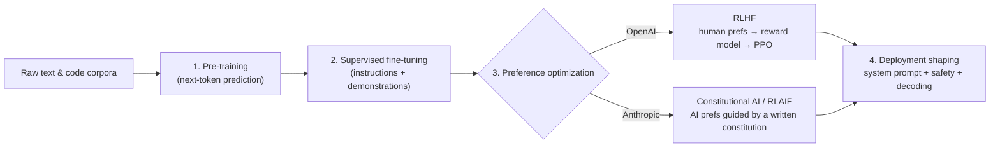
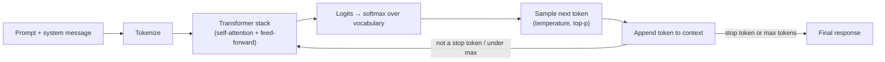
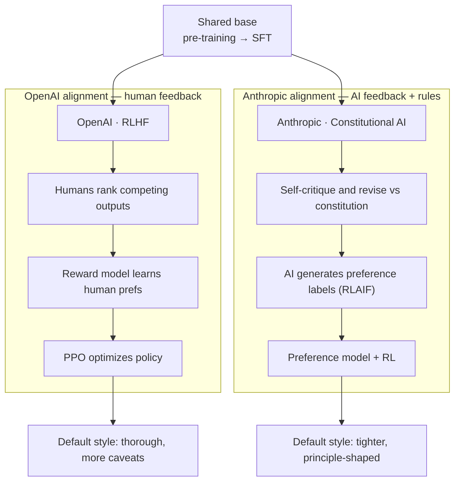
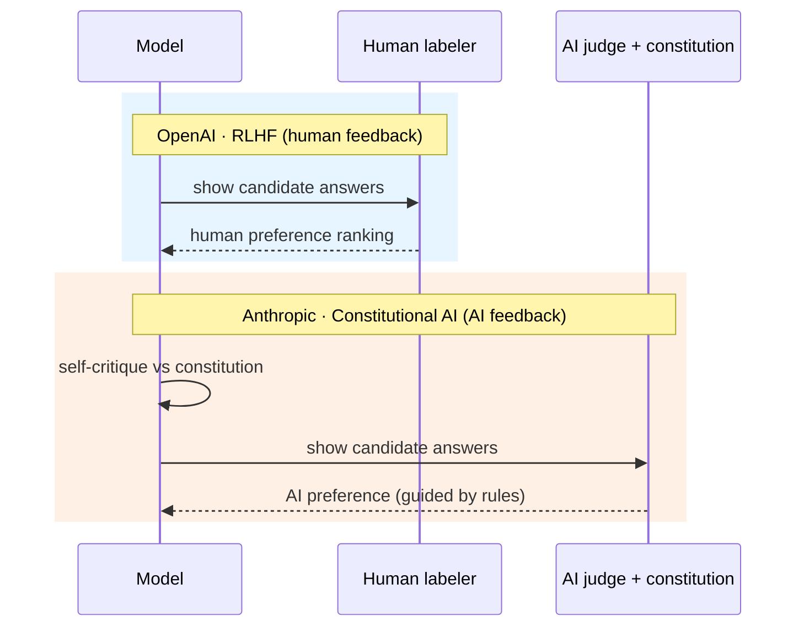
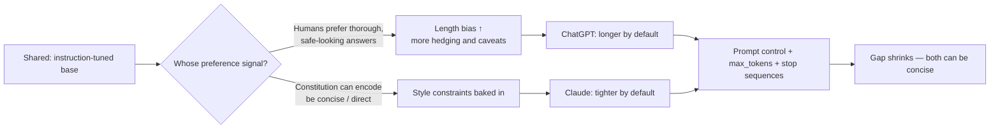

# OpenAI (ChatGPT/GPT) vs Anthropic (Claude) — A Multi-Factor Comparison

A side-by-side look at how OpenAI's GPT models and Anthropic's Claude models compare
across the factors that matter for real work — with a focus on the question this repo
exists to answer: **why does Claude often feel more concise?**

> ⚠️ **Currency & accuracy note.** Both products evolve fast (new model versions,
> changed defaults, new pricing). Qualitative tendencies below reflect widely reported
> community and vendor patterns, **not** fixed facts. Verbosity numbers come from this
> repo's **synthetic** demo data unless you run it against the live APIs. Verify
> anything version-specific (pricing, context limits, benchmark scores) against the
> official docs before relying on it.

---

## TL;DR

| | **OpenAI — GPT / ChatGPT** | **Anthropic — Claude** |
| --- | --- | --- |
| **Default style** | Thorough, complete, more caveats | Tends tighter, cleaner prose |
| **Alignment recipe** | RLHF (human preference feedback) | Constitutional AI / RLAIF + RLHF |
| **Feels more concise?** | Less often by default | More often by default |
| **Best lever for brevity** | Explicit prompt constraints | Explicit prompt constraints |
| **Ecosystem maturity** | Very broad, large tooling ecosystem | Strong, growing, API-first |
| **Long-form coherence** | Strong | Often praised for clean long-form |

Bottom line: the *conciseness* difference is mostly **training and product-default
tuning**, not one model being smarter. The strongest equalizer is prompt control —
which this repo quantifies.

---

## 1. Verbosity & conciseness (this repo's focus)

The perceived gap comes from **training and decoding incentives**, not intent:

- **Preference tuning rewards completeness.** Thorough, safe-looking answers are often
  preferred during RLHF/RLAIF, so models learn to elaborate.
- **Uncertainty expands output.** Less-confident answers hedge and pad to avoid error.
- **Decoders favor fluent continuation.** Once in "explanatory mode," generation keeps
  going past the minimum useful point.
- **Safety systems add padding.** Guardrails encourage caveats and broad framing.

Claude *feeling* tighter is usually a mix of model training, response-style tuning, and
**product-level defaults** — not universal superiority.

**How this repo measures it:** see
[src/verbosity_lab/metrics.py](src/verbosity_lab/metrics.py) (length, hedge/caveat/filler
density), [src/verbosity_lab/scoring.py](src/verbosity_lab/scoring.py) (`verbosity_bias`,
`padding_score`), and the **Analysis** tab in [dashboard/app.py](dashboard/app.py).

| Verbosity signal | What it captures | Typical pattern* |
| --- | --- | --- |
| `word_count` / `token_count` | Raw length | GPT defaults longer |
| `hedge_density` | "might, generally, typically…" | Comparable; context-dependent |
| `caveat_density` | "it's important to, as an AI…" | GPT slightly higher by default |
| `verbosity_bias` | Extra words vs leanest answer to same prompt | GPT higher in demo data |
| `padding_score` | 0–100 composite | GPT higher in demo data |

\* *From this repo's synthetic mock data. Replace with a live run to measure the real models.*

---

## 2. RLHF transparency & alignment approach

| Factor | OpenAI | Anthropic |
| --- | --- | --- |
| Primary alignment method | RLHF from human preference data | Constitutional AI / RLAIF (+ RLHF) |
| Public model/system cards | Yes | Yes |
| Preference-data sourcing detail | Limited public detail | Some published detail (e.g. constitution) |
| Length/verbosity-bias discussion | Acknowledged in places | Acknowledged in places |
| Open weights | No (closed) | No (closed) |

This repo ships an **editable** transparency scorecard you can adjust against sources:
[config/rlhf_transparency.yaml](config/rlhf_transparency.yaml), rendered as a radar chart
in the dashboard's **RLHF transparency** tab. The default scores are illustrative
starting points — not authoritative.

---

## 3. Context window & memory

| Factor | OpenAI | Anthropic |
| --- | --- | --- |
| Large context windows | Yes (varies by model) | Yes (often marketed for long docs) |
| Long-document workflows | Strong | Frequently praised |
| Conversation "memory" features | Product-level memory in ChatGPT | Project/again product-dependent |

Exact token limits depend on the specific model version — check current docs.

---

## 4. Coding

| Factor | OpenAI | Anthropic |
| --- | --- | --- |
| Code generation quality | Strong, broad language coverage | Strong; often praised for following intent |
| Refactoring / large diffs | Capable | Frequently cited for clean edits |
| Agentic/tool-driven coding | Mature tooling & integrations | Strong, growing IDE/agent adoption |
| Conciseness of code answers | Can over-explain by default | Often tighter explanations |

Both are highly capable; differences are usually task- and prompt-specific rather than
absolute.

---

## 5. Reasoning & accuracy

| Factor | OpenAI | Anthropic |
| --- | --- | --- |
| Step-by-step reasoning | Strong (esp. reasoning-tuned variants) | Strong |
| Math / structured problems | Strong with reasoning modes | Strong |
| Hallucination tendency | Present (all LLMs); mitigated by grounding | Present; mitigated by grounding |

For both, retrieval/grounding and explicit "show your reasoning / cite sources"
prompting matter more than the brand.

---

## 6. Writing & tone

| Factor | OpenAI | Anthropic |
| --- | --- | --- |
| Default prose | Helpful, sometimes padded | Often described as cleaner/tighter |
| Tone steerability | Good | Good |
| Long-form structure | Strong | Frequently praised |

---

## 7. Safety, refusals & guardrails

| Factor | OpenAI | Anthropic |
| --- | --- | --- |
| Safety posture | Strong | Strong (safety-forward branding) |
| Over-refusal risk | Possible on ambiguous prompts | Possible on ambiguous prompts |
| Caveat/padding from safety | Contributes to verbosity | Contributes to verbosity |

Guardrails are a real contributor to perceived verbosity — they add caveats and framing,
which this repo captures via `caveat_density`.

---

## 8. Steerability & prompt control

This is the **most actionable** factor and the one this repo audits directly.

| Technique | Effect |
| --- | --- |
| "Be concise." | Small reduction |
| "No preamble, no disclaimers." | Moderate reduction |
| "Answer in 40 words or fewer." | Strong reduction |
| "3 bullets, no caveats, no restating the question." | Strong reduction |
| "Answer in exactly one sentence." | Largest reduction |

See [config/techniques.yaml](config/techniques.yaml). The dashboard's **Technique audit**
and **Analysis** tabs rank these by measured % word-count reduction and surface a single
recommended recipe.

---

## 9. Decoding controls (temperature)

| Factor | OpenAI | Anthropic |
| --- | --- | --- |
| Temperature control | Yes (API) | Yes (API) |
| Effect on length | Higher temp can lengthen/vary output | Same general tendency |
| Determinism | Lower temp = steadier output | Lower temp = steadier output |

This repo runs a **temperature sweep** and reports a length-vs-temperature slope per
provider (Analysis tab / `scripts/report.py`).

---

## 10. Multimodality & features

| Factor | OpenAI | Anthropic |
| --- | --- | --- |
| Vision (image input) | Yes | Yes |
| Audio / voice | Yes (product features) | More limited historically |
| Image generation | Yes (product features) | Not a core focus |
| Tool/function calling | Mature | Mature |

Feature parity shifts often — confirm against current product pages.

---

## 11. API, ecosystem & integration

| Factor | OpenAI | Anthropic |
| --- | --- | --- |
| SDK breadth | Very broad | Broad, growing |
| Third-party ecosystem | Largest | Strong |
| Enterprise/cloud availability | Wide (incl. Azure OpenAI) | Wide (incl. major clouds) |
| Streaming, function calling, structured output | Yes | Yes |

This repo talks to both via a thin provider layer:
[src/verbosity_lab/providers.py](src/verbosity_lab/providers.py).

---

## 12. Pricing & privacy (qualitative)

| Factor | OpenAI | Anthropic |
| --- | --- | --- |
| Pricing model | Per-token, tiered by model | Per-token, tiered by model |
| Cost driver | **Output length** matters a lot | **Output length** matters a lot |
| Data-use controls | Enterprise/API opt-outs available | Enterprise/API opt-outs available |

> 💡 Because you pay per output token, **verbosity is also a cost issue** — the
> conciseness techniques in this repo can directly lower spend. Exact prices change
> frequently; check the official pricing pages.

---

## 13. Training pipeline: pre-training → fine-tuning → alignment

Both GPT and Claude are **decoder-only autoregressive transformers** trained in broadly
the same multi-stage pipeline. The headline difference is **how preferences are
collected in the alignment stage** — humans (OpenAI's RLHF) vs AI feedback guided by an
explicit written constitution (Anthropic's Constitutional AI / RLAIF).

> ⚠️ Both models are **closed**. Exact architectures (parameter counts, mixture-of-experts,
> attention variants), training datasets, and full alignment recipes are **not publicly
> disclosed**. The descriptions below are the publicly documented *methodology* in
> general terms, not internal specifics.



| Stage | OpenAI (GPT) | Anthropic (Claude) |
| --- | --- | --- |
| **1. Pre-training** | Decoder-only transformer; self-supervised **next-token prediction** over very large web/code/text corpora; subword (BPE-style) tokenization; scaling-law–driven | Same family: decoder-only transformer, next-token prediction over large corpora |
| **2. Supervised fine-tuning (SFT)** | Curated **instruction → response** demonstrations teach the base model to follow instructions and adopt an assistant style | Same idea: high-quality demonstrations for instruction following |
| **3. Preference / alignment** | **RLHF** — humans rank competing outputs → a **reward model** learns those preferences → the policy is optimized against it (PPO and newer variants) | **Constitutional AI** — the model **critiques and revises its own answers** against a written set of principles ("constitution"), then **RLAIF** trains a preference model from **AI-generated** labels |
| **4. Deployment shaping** | System prompts, safety filters, and decoding defaults tune final behavior | System prompts, safety filters, and decoding defaults tune final behavior |

### Pre-training (both)
The base model learns language and reasoning purely by predicting the next token across
trillions of tokens. There is no notion of "helpful" or "concise" yet — only statistical
continuation. This stage fixes the model's raw capabilities; everything afterward shapes
*behavior*.

### Supervised fine-tuning (both)
A much smaller, curated set of high-quality instruction/response pairs teaches the model
the assistant format. This is where "answer the user's question" behavior is installed.

### The key divergence — preference optimization
- **OpenAI · RLHF.** Human labelers compare model outputs; a **reward model** is trained
  to predict human preference; the policy is then optimized to maximize that reward
  (classically with PPO). Human judgment is the supervision signal.
- **Anthropic · Constitutional AI (RLAIF).** A two-phase process:
  1. **Supervised phase** — the model generates an answer, then **self-critiques and
     revises** it against an explicit written **constitution** of principles.
  2. **RL phase** — instead of human harmlessness labels, an **AI model produces
     preference labels** (guided by the constitution) to train a preference model, which
     then drives RL. This scales alignment with less human labeling and makes the target
     values **more explicit and auditable**.

> 🔎 **Why both can still be verbose.** Reward/preference models tend to favor answers
> that *look* thorough, safe, and complete — a documented **length bias** in preference
> optimization. So elaboration is partly *learned reward-seeking*, not intent. Product
> defaults (system prompts, safety framing) then add more. This is exactly what this repo
> quantifies via `verbosity_bias`, `padding_score`, and `caveat_density`.

---

## 14. How the internals work (inference)

At generation time both are **autoregressive**: they emit **one token at a time**, feeding
each new token back in to predict the next, until a stop token or length limit is hit.



**The building blocks (shared by both):**

| Component | Role |
| --- | --- |
| **Tokenizer** | Splits text into subword tokens (and detokenizes output) |
| **Embeddings + positions** | Map tokens to vectors the network can process |
| **Stacked transformer blocks** | **Self-attention** mixes information across the context; **feed-forward** layers transform it |
| **Output head + softmax** | Turn the final hidden state into a probability over the whole vocabulary |
| **Sampler** | Picks the next token using the decoding controls |
| **KV cache** | Stores past attention keys/values so each new token is cheap to generate |

**Decoding controls that shape output (exposed in both APIs):**

| Control | Effect | Verbosity link |
| --- | --- | --- |
| `temperature` | Flattens/sharpens the probability distribution | Higher temp → more variety, often **longer** output |
| `top_p` (nucleus) | Restricts sampling to the top probability mass | Tightens or loosens wording |
| `max_tokens` | Hard cap on output length | Direct brevity lever |
| `stop` sequences | Force an early end | Trims trailing padding |
| frequency/presence penalties (OpenAI) | Discourage repetition | Reduces filler/restatement |

**Why this produces "yapping."** Generation is greedy-ish continuation: once the model
enters an *explanatory mode*, each fluent token makes the next explanatory token likely,
so it keeps going past the minimum useful point. The model has **no built-in sense of
"enough"** unless the prompt, a stop sequence, or `max_tokens` provides one. Raising
temperature widens this tendency — which is why this repo runs a **temperature sweep** and
reports a length-vs-temperature slope per provider (see
[src/verbosity_lab/analysis.py](src/verbosity_lab/analysis.py) and the dashboard's
**Temperature** tab).

> 💡 **Takeaway from the internals:** the most reliable brevity levers are the ones that
> change the *decoding/stopping* conditions or the *instruction*, not hoping the model
> self-limits — exactly the techniques audited in
> [config/techniques.yaml](config/techniques.yaml).

---

## 15. Visualizing *why* the two differ

Three views of the same story: a **shared base model** is shaped by **different feedback
sources**, which nudges **different default styles** — but the same prompt-control levers
equalize both.

### 15.1 Side-by-side alignment pipelines
The capabilities are shared; the **alignment feedback source** is the fork in the road.



### 15.2 Who provides the preference signal?
RLHF relies on **human** rankings; Constitutional AI substitutes an **AI judge guided by
written rules**, which makes the target values more explicit and scales labeling.



### 15.3 The causal chain to verbosity
Why the *defaults* feel different — and why the gap closes once you control the prompt.



> 🔎 **Read the chain as:** *same capabilities → different feedback → different default
> verbosity → same fix (prompt control).* This repo measures every box on the right of the
> fork: `verbosity_bias`, `padding_score`, and the technique-reduction leaderboard.

---

## How to turn opinions into measurements

Don't argue about which is more concise — measure it:

```powershell
# 1. synthetic demo (no API keys)
python scripts/generate_sample_data.py
python scripts/report.py            # console + reports/verbosity_report.html
streamlit run dashboard/app.py

# 2. real models (after adding keys to .env)
python scripts/run_experiment.py --providers openai anthropic `
  --temperatures 0.0 0.5 1.0 --repeats 2 --out data/results.csv
python scripts/report.py --input data/results.csv
```

## Practical takeaway

Both models are highly capable; the **conciseness** difference is mostly default-tuning,
not intelligence. The strongest, model-agnostic lever is **prompt control**:

> "Answer in 3 bullets, no caveats, no restating the question, only the highest-signal points."

Use the [technique audit](config/techniques.yaml) to find the exact instruction that
gives you the brevity you want with the least loss of signal.
